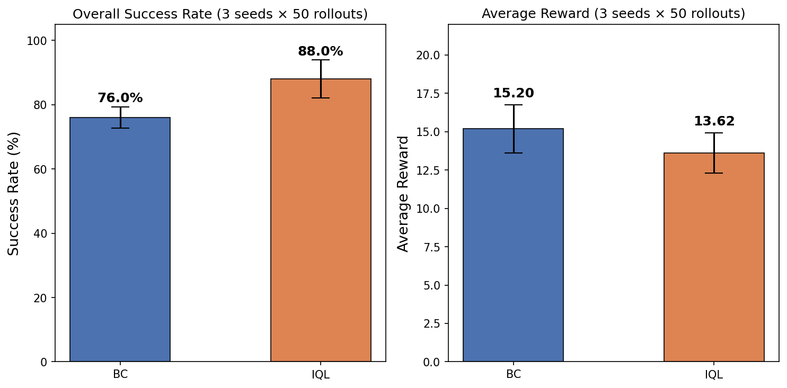
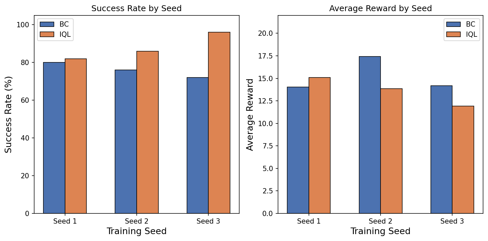
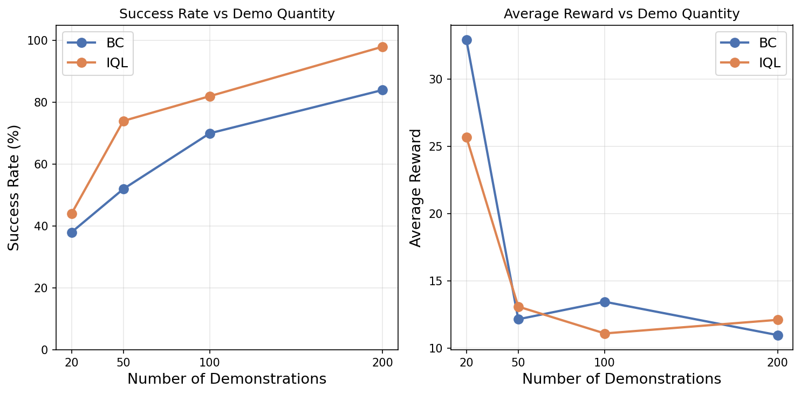
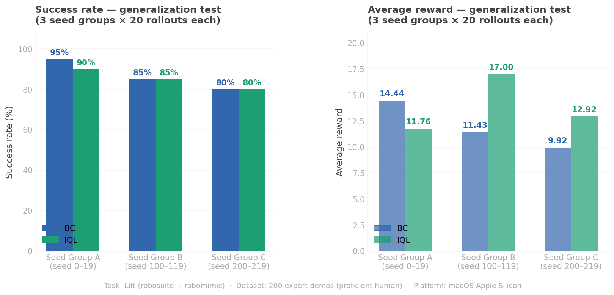
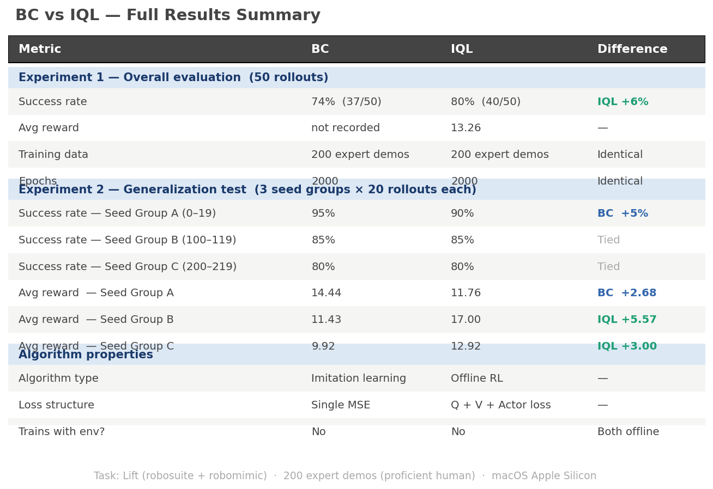

# Imitation Learning: BC vs IQL on Robotic Manipulation

**TL;DR:** Behavior Cloning (BC) and Implicit Q-Learning (IQL) are trained on identical expert demonstrations for the robosuite Lift task. Across 3 training seeds × 50 rollouts each, IQL achieves consistently higher success rate (88.0% ± 5.9% vs 76.0% ± 3.3%). A demo quantity ablation (20–200 demos) further shows IQL's advantage is largest under data scarcity, reaching +22pp at 50 demos — suggesting IQL extracts more value from limited demonstrations.

---

## Quick Start

```bash
# 1. Setup
conda create -n robosuite_env python=3.9 && conda activate robosuite_env
pip install -r requirements.txt

# 2. Download dataset (place in ./data/)
#    https://robomimic.github.io/docs/datasets/robomimic_v0.1.html

# 3. Train
python -m robomimic.scripts.train --config configs/bc_lift.json
python -m robomimic.scripts.train --config configs/iql_lift.json

# 4. Evaluate (replace with your checkpoint paths)
python scripts/bc_rollout.py --ckpt outputs/bc_lift/<run>/models/model_epoch_2000.pth
python scripts/iql_rollout.py --ckpt outputs/iql_lift/<run>/models/model_epoch_2000.pth
python scripts/generalization_test.py \
    --bc_ckpt outputs/bc_lift/<run>/models/model_epoch_2000.pth \
    --iql_ckpt outputs/iql_lift/<run>/models/model_epoch_2000.pth
```

---

## Task

The **Lift** task requires a Panda robot arm to locate a cube on a tabletop and lift it above a target height. The robot is controlled via an OSC_POSE controller (7-dimensional end-effector delta commands). Observations are 42-dimensional, combining proprioceptive state and object state.

---

## Algorithms

**BC (Behavior Cloning)** is a supervised learning approach that directly regresses the expert's action at each timestep. It is simple and fast to train, but its performance is bounded by the quality and coverage of the demonstration data. When the agent encounters states not seen during training, prediction errors compound — a phenomenon known as covariate shift.

**IQL (Implicit Q-Learning)** is an offline reinforcement learning algorithm that learns a Q-function and a separate value function (V-function) from demonstration data, without ever querying actions outside the dataset. By replacing the standard max operator in the Bellman update with an expectile regression over the V-function, IQL avoids overestimating the value of out-of-distribution actions — the central challenge of offline RL. This allows it to reason about long-term return rather than simply imitating observed actions.

---

## Dataset

Both models are trained on the official robomimic **proficient-human (ph)** dataset for the Lift task.

| Property | Value |
|---|---|
| File | `low_dim_v141.hdf5` |
| Trajectories | 200 expert demonstrations |
| Steps per trajectory (avg) | ~59 |
| Observation dimension | 42 |
| Action dimension | 7 (OSC_POSE) |

The dataset is not included in this repository due to its size. It can be downloaded from the [robomimic dataset page](https://robomimic.github.io/docs/datasets/robomimic_v0.1.html) and should be placed in `./data/`.

---

## Results

### Experiment 1 — Multi-seed evaluation (3 seeds × 50 rollouts each)

Each algorithm was trained 3 times with different random seeds (seed 1, 2, 3) and evaluated with 50 rollouts per checkpoint.

| Metric | BC | IQL |
|---|---|---|
| Success rate (mean ± std) | 76.0% ± 3.3% | **88.0% ± 5.9%** |
| Avg reward (mean ± std) | **15.20 ± 1.57** | 13.62 ± 1.31 |
| Training epochs | 2000 | 2000 |

| Seed | BC SR | IQL SR | BC Reward | IQL Reward |
|---|---|---|---|---|
| 1 | 80.0% | 82.0% | 14.02 | 15.10 |
| 2 | 76.0% | 86.0% | 17.41 | 13.84 |
| 3 | 72.0% | **96.0%** | 14.17 | 11.92 |

**Key findings:**

IQL consistently outperforms BC in success rate across all 3 training seeds, with a mean advantage of +12 percentage points. The gap widens with seed variation — IQL's best run (seed 3, 96%) far exceeds BC's best (seed 1, 80%), suggesting IQL is more robust to training initialization.

BC achieves slightly higher average reward (15.20 vs 13.62), indicating that when BC succeeds, its trajectories are more efficient — consistent with BC's strength as a precise imitator within its training distribution. IQL succeeds more often but may take longer or less direct paths to task completion.





### Experiment 2 — Demo quantity ablation (20 / 50 / 100 / 200 demos)

To investigate how each algorithm responds to limited demonstration data, we trained BC and IQL on subsampled datasets of 20, 50, 100, and 200 demos (randomly selected with a fixed seed for reproducibility).

> *Note: Each ablation run uses a single training seed (seed=1). Results here are not directly comparable to the multi-seed experiment above, which averages over 3 seeds.*

| Demos | BC SR | IQL SR | BC Reward | IQL Reward |
|---|---|---|---|---|
| 20 | 38% | 44% | 32.94 | 25.70 |
| 50 | 52% | **74%** | 12.14 | 13.08 |
| 100 | 70% | **82%** | 13.44 | 11.08 |
| 200 | 84% | **98%** | 10.96 | 12.09 |

**Key findings:**

IQL outperforms BC at every data scale, and the advantage is most pronounced in the data-scarce regime: at 50 demos, IQL leads by +22 percentage points (74% vs 52%). This suggests that IQL's ability to reason about long-term return via Q-learning extracts more value from limited demonstrations than BC's pure action imitation.

The anomalously high average reward at 20 demos (BC: 32.94, IQL: 25.70) is a reward shaping artifact — with so few demos, policies fail more often and take longer trajectories, accumulating more shaped intermediate reward despite lower task success. This confirms that success rate and average reward are independent evaluation dimensions and should not be conflated.



### Experiment 3 — Generalization test (3 seed groups × 20 rollouts each)

Three independent seed groups were used to evaluate both models (trained with seed 1 on 200 demos) under different random initializations. BC and IQL were evaluated on identical initial conditions within each group.

| Scenario | BC SR | IQL SR | BC Reward | IQL Reward |
|---|---|---|---|---|
| Seed Group A (0–19) | **95%** | 90% | **14.44** | 11.76 |
| Seed Group B (100–119) | 85% | 85% | 11.43 | **17.00** |
| Seed Group C (200–219) | 80% | 80% | 9.92 | **12.92** |

BC achieves higher success rate under seed group A (initializations closer to its training distribution), consistent with the covariate shift hypothesis. As initialization diversity increases, success rates converge, but IQL maintains consistently higher average reward — indicating better action quality in unfamiliar states even when task completion rates are equivalent.





---

## Reproducing the Experiments

### Environment setup

```bash
conda create -n robosuite_env python=3.9
conda activate robosuite_env
pip install -r requirements.txt
```

### Dataset

Download the Lift proficient-human dataset from the [robomimic dataset page](https://robomimic.github.io/docs/datasets/robomimic_v0.1.html) and place it at `./data/low_dim_v141.hdf5`.

### Training

```bash
python -m robomimic.scripts.train --config configs/bc_lift.json
python -m robomimic.scripts.train --config configs/iql_lift.json
```

Both configs have `rollout.enabled` set to `False` to avoid a `mujoco_py` dependency conflict on newer MuJoCo versions. Evaluation is performed separately via the scripts below.

### Evaluation

```bash
# BC rollout (50 episodes)
python scripts/bc_rollout.py --ckpt <path_to_bc_checkpoint.pth>

# IQL rollout (50 episodes)
python scripts/iql_rollout.py --ckpt <path_to_iql_checkpoint.pth>

# Generalization test (3 seed groups × 20 episodes per model)
python scripts/generalization_test.py \
    --bc_ckpt <path_to_bc_checkpoint.pth> \
    --iql_ckpt <path_to_iql_checkpoint.pth>
```

### Multi-seed experiment

```bash
python scripts/multi_seed_experiment.py
```

Trains BC and IQL with seeds 1, 2, 3, evaluates each with 50 rollouts, and prints mean ± std.

### Demo quantity ablation

```bash
python scripts/create_subsets.py          # Create 20/50/100-demo subsets
python scripts/demo_ablation.py           # Train and evaluate on all subsets
```

Model checkpoints (`.pth` files) are not included due to file size. Training from the provided configs and dataset fully reproduces the reported results.

---

## Repository Structure

```
Imitation-learning/
├── README.md
├── requirements.txt
├── .gitignore
├── configs/
│   ├── bc_lift.json                # BC training config
│   └── iql_lift.json               # IQL training config
├── scripts/
│   ├── bc_rollout.py               # BC evaluation (--ckpt, --n_rollouts)
│   ├── iql_rollout.py              # IQL evaluation (--ckpt, --n_rollouts)
│   ├── generalization_test.py      # Cross-initialization test
│   ├── multi_seed_experiment.py    # 3-seed training + evaluation pipeline
│   ├── plot_multi_seed.py          # Multi-seed result charts
│   ├── create_subsets.py           # Create subsampled demo datasets
│   └── demo_ablation.py           # Demo quantity ablation experiment
└── results/
    ├── multi_seed_comparison.png
    ├── multi_seed_per_seed.png
    ├── demo_ablation.png
    ├── bc_vs_iql_generalization.png
    └── bc_vs_iql_summary_table.png
```

---

## Environment

| Property | Value |
|---|---|
| Platform | macOS, Apple Silicon (arm64) |
| Python | 3.9.25 |
| robosuite | 1.4.1 |
| robomimic | 0.3.0 |
| MuJoCo | 3.2.0 |
